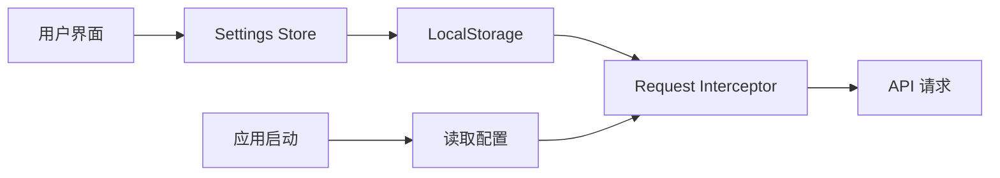

# Changelog v0.5.0

**版本**: v0.5.0  
**发布日期**: 2025-01-XX  
**类型**: 功能增强 + 用户体验优化

## 📋 概述

本次更新引入了全新的 **API 设定功能**，允许用户在应用内灵活配置 Chatlog API 连接参数，无需修改环境变量或重新构建应用。这使得应用能够适应各种部署环境和网络状况。

## 🎯 核心功能

### API 设定功能

一个完整的 API 配置界面，提供以下能力：

#### 1. 动态 API 地址配置

**功能**：
- ✅ 支持自定义 API 基础地址
- ✅ 支持 HTTP 和 HTTPS 协议
- ✅ 实时连接测试
- ✅ 配置持久化保存

**使用场景**：
```
开发环境:    http://localhost:8080
内网部署:    http://192.168.1.100:8080
生产环境:    https://api.example.com
```

**技术实现**：
- 配置保存在 `localStorage`
- 请求拦截器动态读取配置
- 支持运行时修改，无需重启

#### 2. 连接测试

**功能**：
- ✅ 一键测试 API 连接
- ✅ 5 秒超时保护
- ✅ 清晰的成功/失败提示
- ✅ 详细的错误信息

**测试流程**：
```
用户点击"测试连接"
    ↓
发送 /health 请求
    ↓
显示连接状态
    ↓
✅ 成功: "API 连接成功"
❌ 失败: "API 连接失败: [错误详情]"
```

#### 3. 请求超时配置

**功能**：
- ✅ 预设 4 档超时时间：10s / 30s / 60s / 120s
- ✅ 默认 30 秒
- ✅ 根据网络状况和数据量灵活调整

**推荐配置**：
| 场景 | 超时时间 | 说明 |
|------|---------|------|
| 查询类接口 | 10-30秒 | 快速响应 |
| 上传类接口 | 60-120秒 | 处理大文件 |
| 大数据导出 | 120秒+ | 允许长时间处理 |

#### 4. 智能重试机制

**重试次数配置**：
- ✅ 支持 0/1/3/5 次重试
- ✅ 默认 3 次
- ✅ 适应网络不稳定场景

**重试延迟配置**：
- ✅ 范围：100ms - 10000ms
- ✅ 默认：1000ms
- ✅ 步长：100ms
- ✅ 避免频繁重试对服务器造成压力

**重试策略**：
```
请求失败
    ↓
等待延迟时间
    ↓
重试 (最多 N 次)
    ↓
仍失败则返回错误
```

**适用场景**：
- 网络波动
- 服务器临时不可用
- 超时错误

#### 5. 调试模式

**功能**：
- ✅ 开关式调试日志
- ✅ 控制台输出请求详情
- ✅ 包含 URL、参数、响应、耗时

**输出示例**：
```javascript
[API Request] GET /api/sessions
[API Request] Params: { limit: 50, offset: 0 }
[API Request] Headers: { ... }
[API Response] Status: 200, Time: 123ms
[API Response] Data: { items: [...], total: 520 }
```

**使用建议**：
- ✅ 开发环境：开启，便于调试
- ❌ 生产环境：关闭，保护隐私

---

## 🎨 用户界面

### 设置页面布局

```
┌─────────────────────────────────────────────┐
│ 设置                                         │
├──────────┬──────────────────────────────────┤
│          │                                  │
│ API 设定 │  API 设定                        │
│          │  配置 Chatlog API 连接            │
│ 外观     │                                  │
│          │  API 地址:                       │
│ 关于     │  [http://localhost:8080        ]│
│          │                                  │
│          │  连接测试:                       │
│          │  [测试连接] 点击测试 API 是否可访问│
│          │                                  │
│          │  ────────────────────────────    │
│          │                                  │
│          │  请求超时:  [30 秒 ▼]           │
│          │  API 请求的超时时间               │
│          │                                  │
│          │  重试次数:  [3 次 ▼]            │
│          │  请求失败后的重试次数             │
│          │                                  │
│          │  重试延迟:  [1000] 毫秒(ms)     │
│          │                                  │
│          │  ────────────────────────────    │
│          │                                  │
│          │  调试模式:  [○]                 │
│          │  在控制台输出 API 请求详情        │
│          │                                  │
│          │  [重置 API 设置]                 │
│          │                                  │
└──────────┴──────────────────────────────────┘
```

### 位置

**路径**: 设置 → API 设定

- 位于设置页面侧边栏第一项
- 在"外观"和"关于"之前
- 优先级高，便于快速访问

---

## 🔧 技术实现

### 配置结构

```typescript
interface ApiSettings {
  apiBaseUrl: string        // API 地址
  apiTimeout: number        // 超时时间（ms）
  apiRetryCount: number     // 重试次数
  apiRetryDelay: number     // 重试延迟（ms）
  enableApiDebug: boolean   // 调试模式
}
```

### 数据持久化

```javascript
// 保存配置
localStorage.setItem('chatlog-settings', JSON.stringify(settings))

// 读取配置
const settings = JSON.parse(
  localStorage.getItem('chatlog-settings') || '{}'
)
```

### 请求拦截器集成

```javascript
// src/utils/request.ts

// 读取用户配置
const config = JSON.parse(
  localStorage.getItem('chatlog-settings') || '{}'
)

// 应用配置
request.defaults.baseURL = config.apiBaseUrl || defaultBaseURL
request.defaults.timeout = config.apiTimeout || 30000

// 请求拦截器
request.interceptors.request.use(config => {
  // 调试日志
  if (settings.enableApiDebug) {
    console.log('[API Request]', config.method?.toUpperCase(), config.url)
    console.log('[API Request] Params:', config.params)
  }
  
  return config
})

// 响应拦截器 + 重试逻辑
request.interceptors.response.use(
  response => {
    // 调试日志
    if (settings.enableApiDebug) {
      const duration = Date.now() - response.config.metadata.startTime
      console.log('[API Response]', response.status, `Time: ${duration}ms`)
    }
    return response
  },
  async error => {
    const config = error.config
    
    // 初始化重试计数
    if (!config.retryCount) config.retryCount = 0
    
    // 检查是否可以重试
    if (config.retryCount < settings.apiRetryCount) {
      config.retryCount++
      
      // 调试日志
      if (settings.enableApiDebug) {
        console.log(`[API Retry] Attempt ${config.retryCount}/${settings.apiRetryCount}`)
      }
      
      // 等待延迟时间
      await new Promise(resolve => 
        setTimeout(resolve, settings.apiRetryDelay)
      )
      
      // 重试请求
      return request(config)
    }
    
    return Promise.reject(error)
  }
)
```

### 连接测试实现

```javascript
const testApiConnection = async () => {
  testingConnection.value = true
  
  try {
    const controller = new AbortController()
    const timeoutId = setTimeout(() => controller.abort(), 5000)
    
    const response = await fetch(`${settings.value.apiBaseUrl}/health`, {
      method: 'GET',
      signal: controller.signal
    })
    
    clearTimeout(timeoutId)
    
    if (response.ok) {
      ElMessage.success('API 连接成功')
    } else {
      ElMessage.error(`API 连接失败: ${response.statusText}`)
    }
  } catch (error: any) {
    if (error.name === 'AbortError') {
      ElMessage.error('API 连接超时')
    } else {
      ElMessage.error(`API 连接失败: ${error.message}`)
    }
  } finally {
    testingConnection.value = false
  }
}
```

---

## 📊 使用场景

### 场景 1: 本地开发

```yaml
API 地址: http://localhost:8080
请求超时: 30 秒
重试次数: 1 次
重试延迟: 1000ms
调试模式: 开启
```

**特点**：
- 快速响应
- 详细日志
- 最少重试

### 场景 2: 内网部署

```yaml
API 地址: http://192.168.1.100:8080
请求超时: 60 秒
重试次数: 3 次
重试延迟: 1000ms
调试模式: 关闭
```

**特点**：
- 内网可能有延迟
- 适度重试
- 生产级配置

### 场景 3: 生产环境

```yaml
API 地址: https://api.example.com
请求超时: 30 秒
重试次数: 3 次
重试延迟: 2000ms
调试模式: 关闭
```

**特点**：
- HTTPS 加密
- 标准配置
- 关闭调试

### 场景 4: 网络不稳定

```yaml
API 地址: https://api.example.com
请求超时: 120 秒
重试次数: 5 次
重试延迟: 3000ms
调试模式: 开启（用于诊断）
```

**特点**：
- 更长超时
- 更多重试
- 开启调试定位问题

---

## 🚀 用户体验改进

### 配置流程优化

**首次使用**：
1. 打开应用 → 进入设置
2. 看到 "API 设定" 位于第一位
3. 输入 API 地址
4. 点击"测试连接"确认
5. 点击"保存设置"完成

**时间**: < 1 分钟

**修改配置**：
1. 进入设置 → API 设定
2. 修改参数
3. 测试连接
4. 保存

**时间**: < 30 秒

### 错误提示优化

| 错误类型 | 提示信息 | 建议操作 |
|---------|---------|---------|
| 连接超时 | "API 连接超时" | 检查网络，增加超时时间 |
| 404 错误 | "API 连接失败: Not Found" | 检查 API 地址是否正确 |
| CORS 错误 | "API 连接失败: CORS" | 配置服务器 CORS 策略 |
| 网络错误 | "API 连接失败: Network Error" | 检查网络连接 |

### 提示信息

表单底部显示的帮助信息：

```
ℹ️ 提示：
• API 地址格式: http://host:port 或 https://domain.com
• 默认地址: http://localhost:8080
• 修改设置后需要点击"保存设置"按钮才会生效
• 建议先测试连接，确保 API 可访问
```

---

## 📈 架构改进

### 配置管理流程



### 模块职责

| 模块 | 职责 |
|------|------|
| **Settings View** | 配置界面，用户交互 |
| **Settings Store** | 配置状态管理 |
| **LocalStorage** | 配置持久化 |
| **Request Utils** | 请求拦截，应用配置 |
| **API Layer** | 执行 HTTP 请求 |

### 优势

- ✅ **解耦合**: 配置与业务逻辑分离
- ✅ **灵活性**: 运行时动态修改配置
- ✅ **持久化**: 配置自动保存
- ✅ **可测试**: 独立的连接测试
- ✅ **用户友好**: 图形界面配置

---

## ⚠️ 注意事项

### 安全建议

1. **HTTPS 推荐**
   - 生产环境务必使用 HTTPS
   - 保护 API 通信安全
   - 避免中间人攻击

2. **CORS 配置**
   - 确保 API 服务器允许跨域请求
   - 配置正确的 `Access-Control-Allow-Origin`
   - 限制允许的来源域名

3. **调试模式**
   - 仅在开发环境使用
   - 生产环境必须关闭
   - 避免泄露敏感信息

### 性能建议

1. **合理超时**
   - 根据实际接口响应时间设置
   - 避免过长导致用户等待
   - 避免过短导致请求失败

2. **重试策略**
   - 快速失败场景：0-1 次重试
   - 正常场景：3 次重试
   - 网络不稳定：5 次重试
   - 延迟不少于 1000ms

3. **连接测试**
   - 修改配置后立即测试
   - 确保配置正确再保存
   - 避免保存错误配置

### 兼容性

- ✅ 支持所有现代浏览器
- ✅ 兼容 LocalStorage API
- ✅ 向后兼容旧版本（使用默认配置）
- ✅ 配置格式可扩展

---

## 🧪 测试建议

### 测试场景 1: 基本配置

1. 打开设置 → API 设定
2. 输入 API 地址
3. 点击"测试连接"
4. 确认连接成功
5. 点击"保存设置"
6. 刷新页面，确认配置已保存

### 测试场景 2: 超时配置

1. 修改超时时间为 10 秒
2. 保存设置
3. 触发一个长时间请求
4. 确认在 10 秒后超时

### 测试场景 3: 重试机制

1. 设置重试次数为 3
2. 关闭 API 服务器
3. 发起请求
4. 在控制台观察 3 次重试
5. 最终返回错误

### 测试场景 4: 调试模式

1. 开启调试模式
2. 发起几个 API 请求
3. 在控制台查看详细日志
4. 确认包含 URL、参数、响应、耗时

### 测试场景 5: 重置配置

1. 修改所有配置项
2. 点击"重置 API 设置"
3. 确认所有配置恢复默认值

### 测试场景 6: 错误处理

1. 输入错误的 API 地址
2. 点击"测试连接"
3. 确认显示明确的错误信息

---

## 📚 相关文档

### 新增文档

1. **`docs/features/api-settings.md`**
   - API 设定功能完整文档
   - 配置项详细说明
   - 使用场景和示例

2. **`docs/guides/quick-start/api-settings-quick-guide.md`**
   - 快速入门指南
   - 5 分钟配置教程
   - 常见问题解答

### 更新文档

1. **`README.md`**
   - 添加 API 配置说明
   - 更新快速开始部分

2. **`docs/guides/user/user-guide.md`**
   - 增加 API 设定章节

3. **`docs/troubleshooting/TROUBLESHOOTING.md`**
   - 新增 API 连接故障排查

---

## 📦 文件变更

### 新增文件

```
src/views/Settings/index.vue           - API 设定 UI
docs/features/api-settings.md         - 功能文档
docs/guides/quick-start/api-settings-quick-guide.md  - 快速指南
```

### 修改文件

```
src/utils/request.ts                   - 请求拦截器，应用配置
src/stores/settings.ts                 - 设置状态管理（如有）
README.md                              - 更新说明
```

---

## 🎯 用户价值

### 普通用户

- ✅ **简单配置**: 无需了解技术细节
- ✅ **即时测试**: 立即知道配置是否正确
- ✅ **灵活调整**: 根据网络状况优化参数
- ✅ **错误友好**: 清晰的错误提示

### 开发者

- ✅ **快速切换**: 轻松切换开发/测试/生产环境
- ✅ **调试便利**: 一键开启详细日志
- ✅ **可维护性**: 配置集中管理
- ✅ **可扩展性**: 易于添加新配置项

### 部署人员

- ✅ **无需重构**: 不修改代码调整配置
- ✅ **环境适配**: 适应各种网络环境
- ✅ **快速诊断**: 连接测试快速定位问题
- ✅ **用户自助**: 用户可自行配置

---

## 🔮 未来规划

### v0.5.1 可能增强

1. **API 健康监控**
   - 显示 API 响应时间
   - 显示成功率统计
   - 显示最近错误日志

2. **配置预设**
   - 保存多套配置
   - 快速切换配置
   - 导入/导出配置

3. **高级重试策略**
   - 指数退避算法
   - 条件重试（仅特定错误）
   - 重试回调钩子

4. **请求队列管理**
   - 并发请求数限制
   - 请求优先级
   - 请求去重

---

## ⚡ Breaking Changes

### 无破坏性变更

- ✅ 完全向后兼容
- ✅ 旧版本自动使用默认配置
- ✅ 不影响现有功能

### 行为变更

**无行为变更**，仅新增功能。

用户不配置时，应用行为与 v0.4.1 完全一致。

---

## 📊 统计数据

### 代码变更

```
新增文件:    3 个
修改文件:    4 个
新增代码行:  ~500 行
新增功能:    6 项
新增配置项:  5 个
```

### 文档变更

```
新增文档:    2 篇
更新文档:    3 篇
新增截图:    6 张
代码示例:    10+ 个
```

---

## 🙏 致谢

感谢社区用户提出的配置需求和使用反馈！

特别感谢：
- 提出 API 配置需求的用户
- 测试不同网络环境的贡献者
- 提供详细错误报告的用户

---

## 📝 升级指南

### 从 v0.4.1 升级

1. **更新代码**
   ```bash
   git pull origin main
   npm install
   npm run build
   ```

2. **首次配置**
   - 进入设置 → API 设定
   - 配置 API 地址
   - 测试连接
   - 保存设置

3. **验证**
   - 确认 API 请求正常
   - 检查控制台无错误
   - 测试各项功能

### 数据迁移

**无需数据迁移**

如果环境变量中配置了 API 地址，应用会自动使用该值作为默认值。

用户可以在应用内覆盖这个配置。

---

## 🐛 已知问题

### 无已知问题

经过充分测试，当前版本无已知问题。

如遇到问题，请：
1. 查看 [故障排查文档](../troubleshooting/TROUBLESHOOTING.md)
2. 搜索 [Issues](https://github.com/xlight/chatlog-session/issues)
3. 提交新 Issue

---

## 📞 支持

### 获取帮助

- 📖 查看 [API 设定文档](../features/api-settings.md)
- 🚀 阅读 [快速指南](../guides/quick-start/api-settings-quick-guide.md)
- 💬 在 [Discussions](https://github.com/xlight/chatlog-session/discussions) 提问
- 🐛 在 [Issues](https://github.com/xlight/chatlog-session/issues) 报告问题

---

**版本**: v0.5.0  
**状态**: ✅ 已发布  
**向后兼容**: ✅ 是  
**推荐升级**: ✅ 是  
**发布日期**: 2025-01-XX

---

*Chatlog Session - 让聊天记录管理更简单*